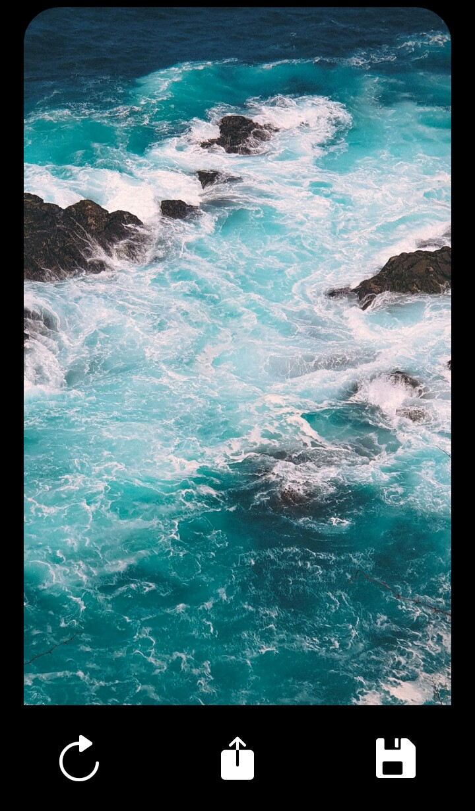
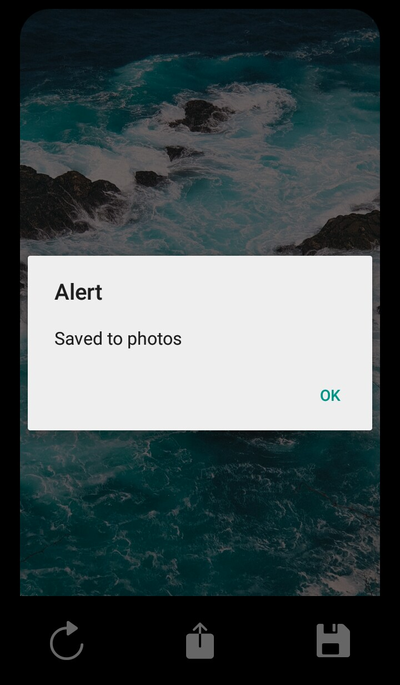
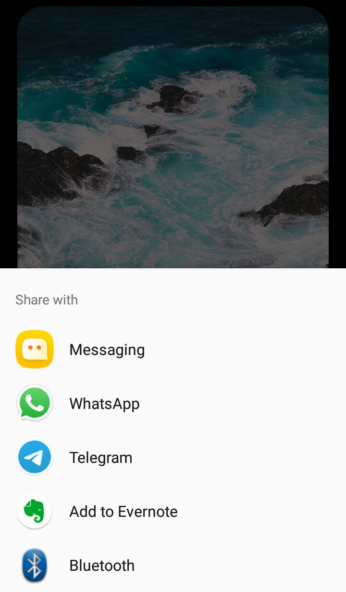

# Wallmob

  
  🔥 A Wallpaper App 🔥
  
  • If you want to download the apk file, click on the following link: 
    Download at: <a href="https://drive.google.com/file/d/1sLAQJWiH22EToF0NY3tJ8bFGm8cr9mEC/view?usp=sharing">LINK</a>
  
 <!---  SCREENSHOOT   -->

     
     
     
     
    

